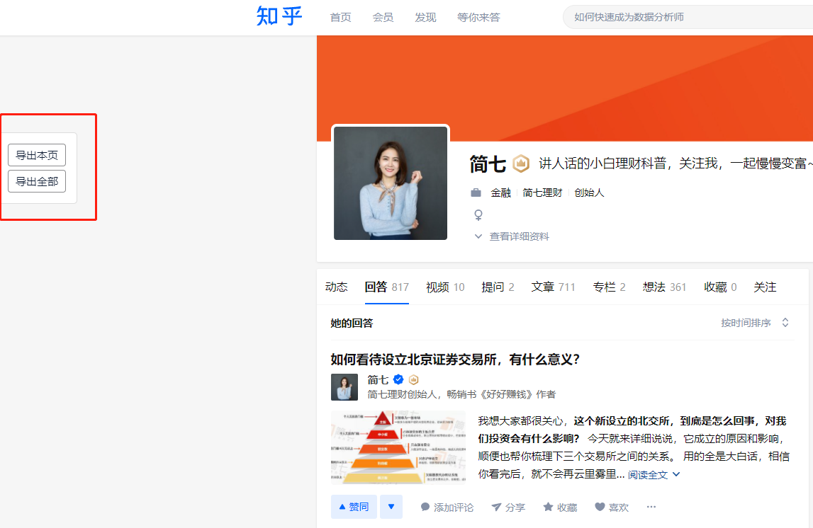

# 获取知乎用户文章、回答等数据

---
## 目前已发布到 [Greasy Fork](https://greasyfork.org/zh-CN/scripts/432443-%E8%8E%B7%E5%8F%96%E7%9F%A5%E4%B9%8E%E7%94%A8%E6%88%B7%E6%96%87%E7%AB%A0-%E5%9B%9E%E7%AD%94%E7%AD%89%E6%95%B0%E6%8D%AE) 上

---
### 获取知乎某用户下的文章数据

1. 可以成功导出某用户主页的单页数据，例如 [简七的个人主页](https://www.zhihu.com/people/jane7ducai/answers) ；
2. 可以成功导出某用户下全部回答、文章数据；
3. 目前导出一页数据大概需要 5.5s 时间；
4. 导出格式为 xslx 的文件；

